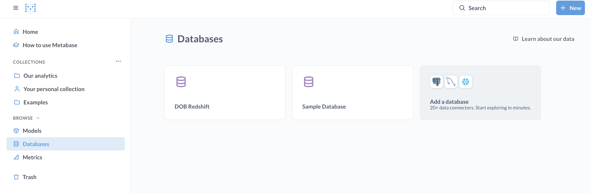
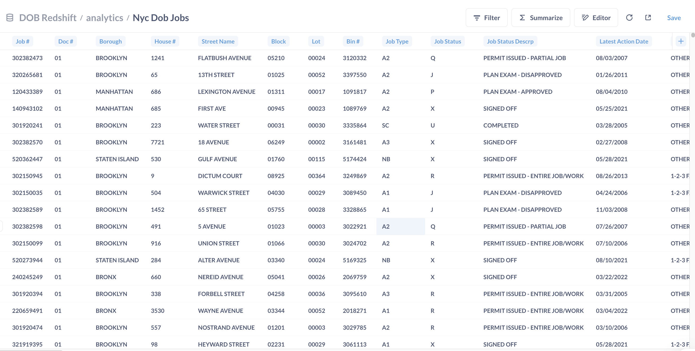
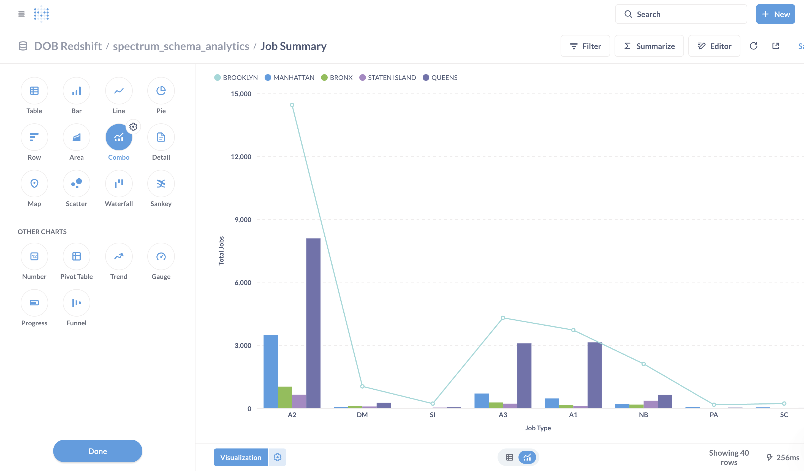
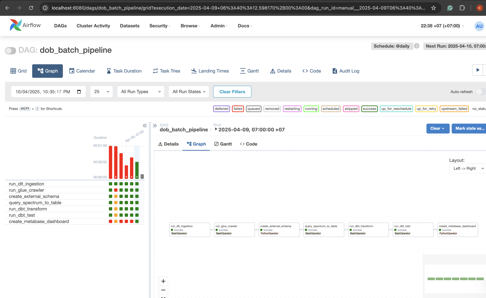

# NYC DOB Job Data Pipeline — DE Zoomcamp 2025 Course Project

This project is part of the Data Engineering Zoomcamp course and follows the full project rubric. It builds a real-world batch data pipeline to ingest, transform, and visualize New York City Department of Buildings (DOB) job application filings using modern data engineering tools and AWS cloud services.

---

## Problem Description

New York City’s Department of Buildings publishes building job application data. This project builds a pipeline that:

- Automates ingestion and transformation of raw job data
- Data load from the API by using dlt(data load tool)
- Stores it in an AWS-based lakehouse architecture (S3 + Redshift)
- Transforms the data using dbt
- Visualizes insights on job types

---

## Dataset & Design Decisions

### Dataset Source

This project uses the [NYC Job Application Filings dataset](https://data.cityofnewyork.us/City-Government/NYC-Jobs/pda4-rgn4/about_data) published by the City of New York.

- It contains detailed information about building job filings in NYC
- The data is **updated daily**, making it suitable for periodic ingestion
- Data is retrieved via a REST API and stored in Parquet format

---

### Why Batch Processing?

Since the dataset is updated daily (not in real-time), a **batch processing** architecture was chosen:

1. Ingestion is triggered **once per day**
1. Keeps infrastructure cost and complexity low
1. Ideal for scheduled workflows using **Airflow**
1. Supports dbt transformations and downstream analytics without needing stream processors

---

## Cloud Setup

- All services are deployed using **AWS**:
  - Redshift Serverless (data warehouse)
  - S3 (data lake)
  - AWS Glue (catalog)
  - IAM Roles for permissions
- Infrastructure provisioned using **Terraform** as IaC(Infrastructure as code)

---

## Pipeline Overview (Batch)

This is a **batch pipeline**, scheduled to run daily via Airflow.

### Pipeline Steps:

1. **DLT Ingestion**: Calls NYC DOB Job API and stores data as Parquet in **s3**
2. **Glue Crawler**: Catalogs data into AWS Glue Data Catalog
3. **Redshift Spectrum**: Creates external table from Glue catalog
4. **Internal Copy**: Copies raw data from Spectrum into Redshift internal table
5. **dbt Transform**: Cleans, models, and transform data
6. **dbt Test:** Test data
7. **Metabase Dashboard**: Loads data for business visualization

Orchestrated via **Airflow DAG** with all tasks automated.

---

## Tools & Tech

| Layer                | Tool                        |
|---------------------|-----------------------------|
| Ingestion           | DLT                         |
| Data Lake           | AWS S3                      |
| Catalog             | AWS Glue                    |
| DWH                 | Redshift + Spectrum         |
| Transformations     | dbt                         |
| Orchestration       | Apache Airflow              |
| Visualization       | Metabase                    |
| IaC                 | Terraform                   |
| Language            | Python                      |
| Containerization    | Docker + docker-compose     |

---

## dbt Transformations

- `stg_dob_jobs.sql`: staging model from raw data
- `cleaned_jobs.sql`: final analytics model
- Uses `dbt test` to validate schema and nulls
- Materialized as tables in `analytics` schema

---

##  Dashboard (Metabase)

Dashboard accessible via Metabase with:


We can also see how the data is passed to the metabase, tables and job summary.



Fig1: The database is accessible from metabase



Fig 2: Transformed Data in Redshift 'analytics' Schema



Fig 3: Job Summary based on the Job Type

---

## Infrastructure with Terraform

Provisioned using `terraform/`:

- Redshift Serverless Workgroup
- IAM Role for Redshift Spectrum
- Glue Database + Crawler
- S3 Path & Permissions

State files are excluded via `.gitignore`.

##  Project Structure

```plaintext
DOB-JOB-DE-PROJECT/
├── dags/                         # Airflow DAGs and dbt project
│   ├── dob_dbt_project/          # dbt transformations
│   │   ├── analyses/
│   │   ├── macros/
│   │   ├── models/
│   │   ├── seeds/
│   │   ├── snapshots/
│   │   ├── tests/
│   │   ├── dbt_project.yml
│   │   ├── profiles.yml
│   │   └── .gitignore
│   └── full_pipeline_dag.py      # Airflow DAG to run the pipeline
│
├── job-dlt-pipeline/             # DLT ingestion pipeline
│   ├── .dlt/
│   │   ├── config.toml    # (Should be gitignored)
│   │   └── secrets.toml   # (Should be gitignored)
│   ├── rest_api_pipeline.py
│   └── .gitignore
│
├── scripts/                      # Custom scripts for AWS, Redshift, etc.
│   ├── copy_to_redshift.py
│   ├── create_external_schema.py
│   ├── metabase_automation.py
│   └── run_glue_crawler.py
│
├── terraform/                    # Infrastructure as Code (Terraform)
│   ├── main.tf
│   ├── variables.tf
│   ├── outputs.tf
│   ├── terraform.tfvars          # (Should be gitignored)
│   ├── terraform.tfstate         
│   ├── .terraform/               # (Should be gitignored)
│   ├── .terraform.lock.hcl
│   └── .gitignore
│
├── Dockerfile                    # Custom Airflow image
├── docker-compose.yaml           # Run Airflow + Metabase
├── requirements.txt              # Python dependencies
├── .env                          # Actual secrets (excluded from Git)
├── .env.example                  # Example env file
├── .gitignore
├── README.md                     # Project documentation
└── Data-Dashboard/
    └── dash-board.gif     # Image for README preview
```
---

##  Reproducibility

### 1. Clone this repo & setup env

```
git clone https://github.com/YOUR_USERNAME/nyc-dob-job-pipeline.git
cd nyc-dob-job-pipeline
```
Please create .env file and fill in(Please check the .envExample):

- AWS keys
- Redshift credentials
- IAM role
- Metabase user
- dlt secret.toml

### 2. Provision AWS Infrastructure Using Terraform
Terraform will create all required AWS resources automatically and please define terraform variable before running the following command:

```
cd terraform/
terraform init
terraform apply
 ```

Terraform will create:

- S3 bucket for storing raw data
- Redshift Serverless workgroup
- IAM role for Redshift Spectrum
- Glue Crawler and catalog

- After completion, copy any outputs (bucket name, role ARN, etc.) into your .env(Please check .envExample). 

### 3. Manually Set DLT Secrets 

```
# job-dlt-pipeline/.dlt/secrets.toml
[default]
aws_access_key_id = "YOUR_AWS_ACCESS_KEY"
aws_secret_access_key = "YOUR_AWS_SECRET_KEY"
```

- These are required to allow DLT to upload to S3.

### 4. Run containers

From the project root:

```docker-compose build -no-cache```

```docker compose up -d```

If you are running airflow for the first time,

```docker compose run airflow-webserver airflow db init``` (only for the first time)

If you don't have an account for the airflow yet,  you can set it up like this:

```
docker compose run airflow-webserver airflow users create \         
  --username admin \
  --firstname Admin \
  --lastname User \
  --role Admin \
  --email admin@example.com \
  --password admin
```

✅ Airflow: http://localhost:8080

✅ Metabase: http://localhost:3000

Trigger DAG in Airflow to run an entire pipeline.

You will see the airflow orchestration like this:



Fig 4: Airflow DAG 

Note: To Run the Metabase step correctly, you have to put the correct username and password in the .env.

--- 

### Clean Up Resources

Everything is done, when you want to clean this project, you can wipe it out by using this command: 

```
cd terraform
terraform destroy
```
It will clean up the AWS resources except s3 bucket because s3 bucket isn't empty.

### Bonus Improvements

1. Airflow DAG with explicit dependencies
1. Automated Metabase dashboard creation
1. Modular repo with separate folders per tool
1. .gitignore for security


###  Redshift VARCHAR Length Fix Issue

During ingestion from Redshift Spectrum to internal Redshift tables, the pipeline encountered the following error:

``` psycopg2.errors.InternalError_: Value too long for type character varying(256) ```

#### Fix:

- All columns were **trimmed using `LEFT(column, 256)`** during the SELECT phase
- The `job_description` column — which contains long text — was preserved using **`VARCHAR(65535)`** in the Redshift table schema
- This ensured compatibility with Redshift without losing important descriptive information

---

These decisions were made to ensure that the pipeline is scalable, cost-efficient, and robust for daily updates.

----

